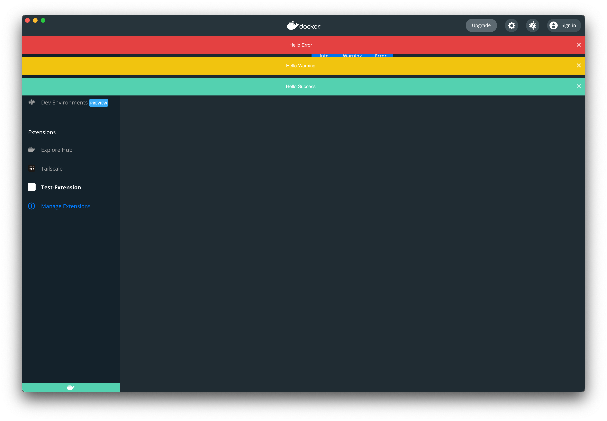

## User notifications

Toasts provide a brief notification to the user. They appear temporarily and
shouldn't interrupt the user experience, they don't require user input to disappear.



```typescript
window.ddClient.toastSuccess("Success!");
```

```typescript
window.ddClient.toastWarning("A warning message");
```

```typescript
window.ddClient.toastError("Something went wrong");
```

## Opening a URL

This function opens an external URL with the system default browser.

```typescript
window.ddClient.openExternal("https://docker.com");
```

_Note:_ the URL must have the protocol `http` or `https`.

## Navigation to Dashboard routes

From your extension, you can navigate to various tabs in Docker Desktop Dashboard.

See details [here](dashboard-routes-navigation.md)
