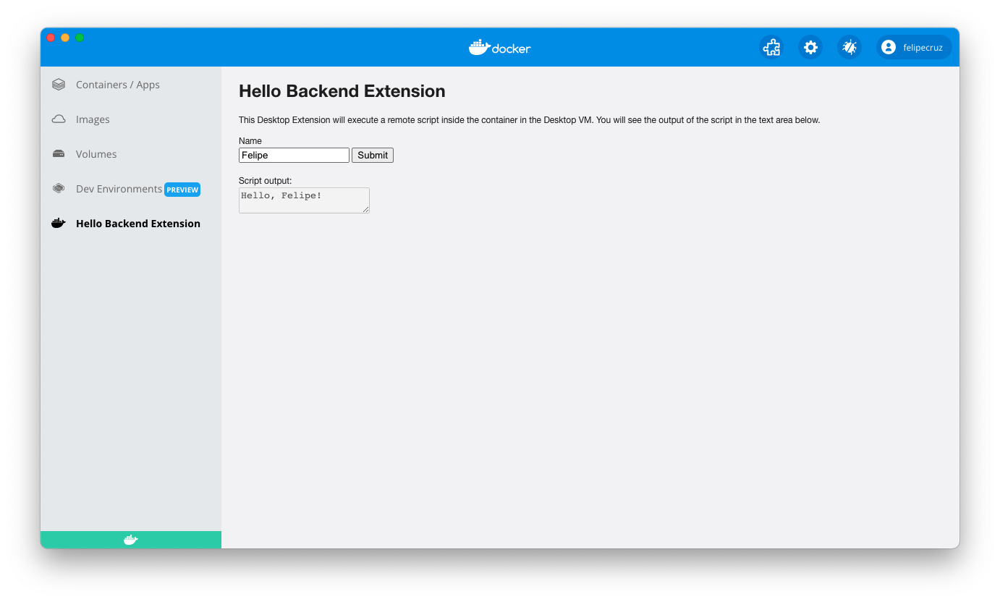

This tutorial describes a minimal example running CLI commands in the backend container. You can also build extensions with a backend services running REST services (over sockets/named pipes), see the `vm-ui extension` sample.

## Prerequisites

- [Docker Desktop build with Extensions capabilities](https://github.com/docker/extensions-sdk/releases/)
- [Docker Extensions CLI](https://github.com/docker/extensions-sdk/releases/)

## Extension folder structure

In the `minimal-backend` sample folder, you can find a ready-to-go example. It represents a UI Extension built on HTML that runs a backend service. We will go through this code example in this tutorial.

```bash
.
├── Dockerfile # (1)
├── Makefile
├── client # (2)
│   └── src
│       ├── App.tsx
│       └── ... React aplication
├── hello.sh # (3)
└── metadata.json # (4)
```

1. Contains everything required to build the extension and run it in Docker Desktop.
2. The source folder that contains the UI application. In this example we use a React frontend, the main part of th extension is an App.tsx.
3. The script that will be run inside the container.
4. A file that provides information about the extension such as the name, description, and version, among others.

## Invoke the extension backend from your javascript code

Let's reuse the React extension from the [React extension tutorial](./react-extension.md), and see how we can invoke our extension backend from the App.tsx file.

We can use the Docker Desktop Client object and then invoke a binary provided in our backend container (living inside the Docker Desktop VM) with `ddClient.docker.extension.vm.cli.exec()`.
In our example, our hello.sh script returns a string as result, we obtain it with `result?.stdout`.

```typescript title="App.tsx"
const ddClient = createDockerDesktopClient();
const [backendInfo, setBackendInfo] = useState<string | undefined>();

async function runExtensionBackend(inputText: string) {
  const result = await ddClient.extension.vm?.cli.exec("./hello.sh", [
    inputText,
  ]);
  setBackendInfo(result?.stdout);
}
```

## The extension's Dockerfile

An extension requires a `Dockerfile` to build, publish and run the extension in Docker Desktop.

The bare minimum configuration that a Dockerfile's extension requires to function properly is:

- Labels - required to provide extra information about the extension.
- The src code - in this case, an `index.html` that sits within the `ui` folder.
- The `metadata.json` file.
- The command to run the container backend service indefinitely.

```Dockerfile title="Dockerfile"
FROM node:17.7-alpine3.14 AS client-builder
# ... build React application

FROM alpine:3.15

LABEL org.opencontainers.image.title="HelloBackend" \
    org.opencontainers.image.description="A sample extension that runs a shell script inside a container's Desktop VM." \
    org.opencontainers.image.vendor="Docker Inc." \
    com.docker.desktop.extension.api.version="1.0.0-beta.1" \
    com.docker.desktop.extension.icon="https://www.docker.com/wp-content/uploads/2022/03/Moby-logo.png"

COPY hello.sh .
COPY metadata.json .
COPY --from=client-builder /app/client/dist ui

CMD [ "sleep", "infinity" ]
```

## Configure the Extension metadata file

A `metadata.json` file is required at the root of the image filesystem.

```json title="metadata.json" linenums="1"
{
  "vm": {
    "image": "${DESKTOP_PLUGIN_IMAGE}"
  },
  "ui": {
    "dashboard-tab": {
      "title": "Hello Backend Extension",
      "root": "/ui",
      "src": "index.html"
    }
  }
}
```

!!! info

    Do **not** replace the `${DESKTOP_PLUGIN_IMAGE}` placeholder in the `metadata.json` file. The placeholder will be replaced automatically with the correct image name when installing the extension.

## Build the extension

```bash
docker build -t desktop-backend-minimal-extension:0.0.1 .
```

### Build the extension for multiple platforms

```bash
docker buildx build --platform=linux/amd64,linux/arm64 -t desktop-backend-minimal-extension:0.0.1 .
```

## Validate the extension

Next, verify the extension image complies with the requisites to be a compliant Desktop Extension.

```bash
docker extension validate desktop-backend-minimal-extension:0.0.1
```

The validation will check if the extension's `Dockerfile` specifies all the required labels and if the metadata file is valid against the JSON schema file.

If your extension is valid, you should see the following message:

`The extension image "desktop-backend-minimal-extension:0.0.1" is valid`.

## Install the extension

Now that the extension is packaged as a Docker image, let's proceed with the installation. To do so, we'll use the Docker Extensions CLI.

!!! info Enable Docker Desktop Extensions

    Ensure the Extensions capabilities are enabled in the Docker Desktop build by running `docker extension enable`
    To install the extension in Docker Desktop, run:

```bash
docker extension install desktop-backend-minimal-extension:0.0.1
```

If the installation was successful, you should see the following output:

```bash
Installing new extension "hello-backend" with desktop-backend-minimal-extension:0.0.1 ...
Installing service in Desktop VM...
Setting additional compose attributes
VM service started
Installing Desktop extension UI for tab "Hello Backend Extension"...
Extension UI tab "Hello Backend Extension" added.
Extension "hello-backend" installed successfully
```

## Preview the extension

You can verify that the extension has been installed successfully using the following CLI command:

```bash
docker extension ls
```

It outputs all the extensions installed:

```bash
PLUGIN              PROVIDER            IMAGE                           UI                      VM      HOST
hello-backend       Docker Inc.         desktop-backend-minimal-extension:0.0.1   1 tab(Hello Backend Extension)   Running(1)          -
```

To preview the extension in Docker Desktop, close and open the Docker Desktop Dashboard once the installation has completed.

On the left-menu, you should see a new tab with the name `Hello Backend Extension`. Click on it to load the main window that will render content of the `index.html` page.



## Publish the extension

In order to publish the extension, we have to upload the Docker image to [DockerHub](https://hub.docker.com).

Let's tag the previous image to preprend the account owner at the beginning of the image name:

```bash
docker tag desktop-backend-minimal-extension:0.0.1 owner/desktop-backend-minimal-extension:0.0.1
```

```bash
docker push owner/desktop-backend-minimal-extension:0.0.1
```

!!! warning

    Note that for Docker Extensions images to be listed in Docker Desktop, they must be approved by Docker and be tagged following semantic versioning, e.g: `0.0.1`.

    See [distribution and new releases](../extensions/DISTRIBUTION.md#distribution-and-new-releases) for more information.

    See <a href="https://semver.org/" target="__blank">semver.org</a> to learn more about semantic versioning.

!!! info "Having trouble to push the image?"

    Ensure you are logged into DockerHub. Otherwise, run `docker login` to authenticate.

## Clean up

To remove the extension run:

```bash
docker extension rm hello-backend
```

The following output should be displayed:

```bash
Removing extension hello-backend...
Removing extension VM service...
Extension removed from Desktop VM
Extension UI tab Hello Backend Extension removed
Extension "hello-backend" removed
```
