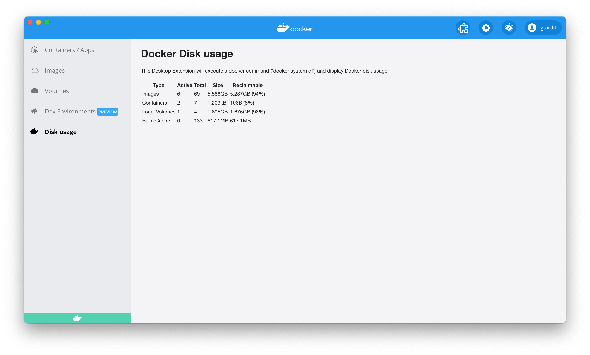

This tutorial describes a minimal example running frontend extension and invoking docker CLI commands.

## Prerequisites

- [Docker Desktop build with Extensions capabilities](https://github.com/docker/desktop-extension-samples/releases/)
- [Docker Extensions CLI](https://github.com/docker/desktop-extension-samples/releases/)

## Extension folder structure

A Desktop Extension is comprised of several files, ranging from the extension's source code to required Extension-specific files.

In the `minimal-docker-cli` folder, at the root of the repository, you can find a ready-to-go example that represents a UI Extension invoking docker commands. We will go through this code example in this tutorial.

```bash
.
├── Dockerfile # (1)
├── metadata.json # (2)
└── ui # (3)
    ├──  index.html
    └──  script.js
```

1. Contains everything required to build the extension and run it in Docker Desktop.
2. A file that provides information about the extension such as the name, description, and version, among others.
3. The source folder that contains all your HTML, CSS and JS files. These can also be other static assets like logos, icons, etc.

## The extension's Dockerfile

An extension requires a `Dockerfile` to build, publish and run in Docker Desktop.

The bare minimum configuration that a Dockerfile's extension requires to function properly is:

- Labels - required to provide extra information about the extension.
- The source code - in this case, an `index.html` that sits within the `ui` folder. `index.html` refers to javascript code in `script.js`.
- The `metadata.json` file.

```Dockerfile title="Dockerfile" linenums="1"
FROM scratch

LABEL org.opencontainers.image.title="MyExtension" \
    org.opencontainers.image.description="A sample extension to show how easy it's to get started with Desktop Extensions." \
    org.opencontainers.image.vendor="Docker Inc." \
    com.docker.desktop.extension.api.version="1.0.0-beta.1"

COPY ui ./ui
COPY metadata.json .
```

## Configure the Extension metadata file

A `metadata.json` file is required at the root of the image filesystem.

```json title="metadata.json" linenums="1"
{
  "desktop-plugin-version": "1.0.0-beta.1",
  "name": "MyExtension",
  "provider": "Docker Inc.",
  "ui": {
    "dashboard-tab": {
      "title": "My Extension",
      "root": "/ui",
      "src": "index.html"
    }
  }
}
```

## Invoke docker CLI in your javascript code

A `script.js` includes code that is executed when the extension tab is shown.

In Javascript, extensions can use `windows.ddClient` to get access to the Docker Desktop extension API.

On this ddClient object we can invoke `ddClient.ExecDockerCmd("sytem", "df", "--format", "'{{ json . }}'")`, and then use `res.parseJsonLines()` to read results as json objects.

The rest is purely formatting code using the output of the Docker command:

```javascript
window.ddClient
  .execDockerCmd("system", "df", "--format", "'{{ json . }}'")
  .then((res) => {
    document.getElementById("size-info").innerHTML = `
  <table>
    <tr> <th>Type</th> <th>Active</th> <th>Total</th> <th>Size</th> <th>Reclaimable</th> </tr>
    ${res
      .parseJsonLines()
      .map(
        (cat) =>
          `<tr> <td>${cat.Type}</td> <td>${cat.Active}</td> <td>${cat.TotalCount}</td> <td>${cat.Size}</td> <td>${cat.Reclaimable}</td> </tr>`
      )
      .join("")}
  </table>
`;
  });
```

## Build the extension

```bash
docker build -t desktop-docker-cli-minimal-extension:0.0.1 .
```

### Build the extension for multiple platforms

```bash
docker buildx build --platform=linux/amd64,linux/arm64 -t desktop-docker-cli-minimal-extension:0.0.1 .
```

## Validate the extension

Next, verify the extension image complies with the requisites to be a compliant Desktop Extension.

The validation will check if the extension's `Dockerfile` specifies all the required labels and if the metadata file is valid against the JSON schema file.

```bash
docker extension validate desktop-docker-cli-minimal-extension:0.0.1
```

If your extension is valid, you should see the following message:

`The extension image "desktop-docker-cli-minimal-extension:0.0.1" is valid`.

## Install the extension

Now that the extension is packaged as a Docker image, let's proceed with the installation. To do so, we'll use the Docker Extensions CLI.

!!! info "Enable Docker Desktop Extensions"

    Ensure the Extensions capabilities are enabled in the Docker Desktop build by running `docker extension enable`

To install the extension in Docker Desktop, run:

```bash
docker extension install desktop-docker-cli-minimal-extension:0.0.1
```

If the installation was successful, you should see the following output:

```bash
Installing new extension "MyExtension" with desktop-docker-cli-minimal-extension:0.0.1 ...
Installing Desktop extension UI for tab "My Extension"...
Extension UI tab "Disk usage" added.
Extension "MyExtension" installed successfully
```

## Preview the extension

You can verify that the extension has been installed successfully using the following CLI command:

```bash
docker extension ls
```

It outputs all the extensions installed:

```bash
PLUGIN              PROVIDER            IMAGE                                       UI                  VM  HOST
MyExtension         Docker Inc.         desktop-docker-cli-minimal-extension:0.0.1  1 tab(My Extension) -   -
```

To preview the extension in Docker Desktop, close and open the Docker Desktop Dashboard once the installation has completed.

On the left menu, you should see a new tab with the name `Disk usage`. Click on it to load the main window that will run the javascript code, invoke the `docker system df` command, and render the results.



## Publish the extension

In order to publish the extension, we have to upload the Docker image to [DockerHub](https://hub.docker.com).

Let's tag the previous image to preprend the account owner at the beginning of the image name:

```bash
docker tag desktop-docker-cli-minimal-extension:0.0.1 owner/desktop-docker-cli-minimal-extension:0.0.1
```

```bash
docker push owner/desktop-docker-cli-minimal-extension:0.0.1
```

!!! warning

    Note that for Docker Extensions images to be listed in Docker Desktop, they must be approved by Docker and be tagged following semantic versioning, e.g: `0.0.1`.

    See [distribution and new releases](../extensions/DISTRIBUTION.md#distribution-and-new-releases) for more information.

    See <a href="https://semver.org/" target="__blank">semver.org</a> to learn more about semantic versioning.

!!! info "Having trouble to push the image?"

    Ensure you are logged into DockerHub. Otherwise, run `docker login` to authenticate.

## Clean up

```bash
docker extension rm desktop-docker-cli-minimal-extension
```

The following output should be displayed:

```bash
Removing extension MyExtension...
Extension UI tab Disk usage removed
Extension "MyExtension" removed
```

## What's next?

See the next [tutorial](../minimal-backend-extension) to create a minimal backend extension.
