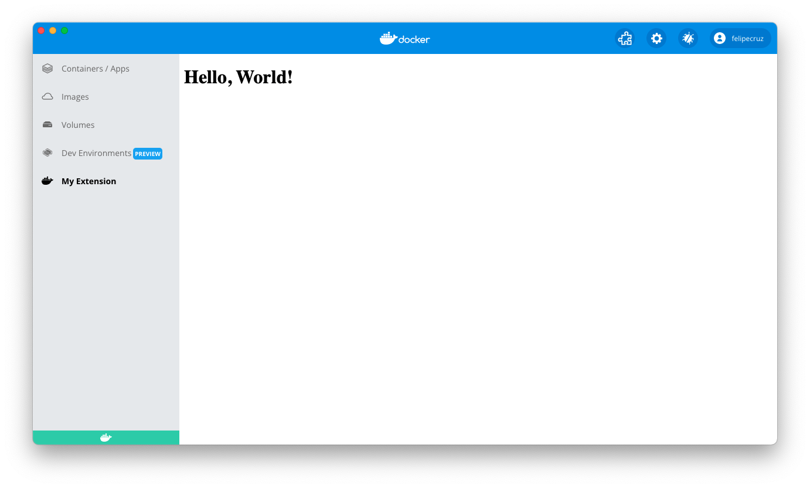

In this tutorial you will learn how to create the most minimal Desktop Extension containing only a UI part based on HTML.

## Prerequisites

- [Docker Desktop build with Extensions capabilities](https://github.com/docker/desktop-extension-samples/releases/)
- [Docker Extensions CLI](https://github.com/docker/desktop-extension-samples/releases/)

## Extension folder structure

A Desktop Extension is comprised of several files, ranging from the extension's source code to required Extension-specific files.

In the `hello-world` folder, at the root of the repository, you can find a ready-to-go example that represents a UI Extension built on HTML. We will go through this code example in this tutorial.

```bash
.
├── Dockerfile # (1)
├── metadata.json # (2)
└── ui # (3)
    └── index.html
```

1. Contains everything required to build the extension and run it in Docker Desktop.
2. A file that provides information about the extension such as the name, description, and version, among others.
3. The source folder that contains all your HTML, CSS and JS files. These can also be other static assets like logos, icons, etc.

## The extension's Dockerfile

An extension requires a `Dockerfile` to build, publish and run in Docker Desktop.

The bare minimum configuration that a Dockerfile's extension requires to function properly is:

- Labels - required to provide extra information about the extension.
- The src code - in this case, an `index.html` that sits within the `ui` folder.
- The `metadata.json` file.

```Dockerfile title="Dockerfile" linenums="1"
FROM scratch

LABEL org.opencontainers.image.title="MyExtension" \
    org.opencontainers.image.description="A sample extension to show how easy it's to get started with Desktop Extensions." \
    org.opencontainers.image.vendor="Docker Inc." \
    com.docker.desktop.extension.api.version="1.0.0-beta.1"

COPY ui ./ui
COPY metadata.json .
```

## Configure the Extension metadata file

A `metadata.json` file is required at the root of the image filesystem.

### Labels

| Label | Required | Description | Example |
| ------------------------------------------ | ------------------------------------------ | ------------------------------------------------------------------------------ | |
| `org.opencontainers.image.title` | Yes | Human-readable title of the image (string). It is what appears in the tab. | my-extension |
| `org.opencontainers.image.description` | Yes | Human-readable description of the software packaged in the image (string) | This extension is cool|
| `org.opencontainers.image.vendor` | Yes | Name of the distributing entity, organization or individual. | Acme, Inc. |
| `com.docker.desktop.extension.api.version` | Yes | Version of the Docker Extension manager that the extension is compatible with. | `1.0.0-beta.1`|
| `com.docker.desktop.plugin.icon` | No | The extension icon (format? .png? .jpg?) | <a href="https://www.docker.com/sites/default/files/d8/2019-07/Moby-logo.png" target="__blank">https://www.docker.com/sites/default/files/d8/2019-07/Moby-logo.png<a> |

!!! warning "Missing required labels"

    If any of the previous _required_ labels are missing in the `Dockerfile`, Docker Desktop will consider the extension invalid and will not appear listed in the Extensions list.

## Configure the Extension metadata file

A `metadata.json` file is required at the root of your extension directory.

```json title="metadata.json" linenums="1"
{
  "desktop-plugin-version": "1.0.0-beta.1",
  "name": "MyExtension",
  "provider": "Docker Inc.",
  "ui": {
    "dashboard-tab": {
      "title": "My Extension",
      "root": "/ui",
      "src": "index.html"
    }
  }
}
```

### Validation

Next, validate the Extension metadata file against the JSON schema file.

```bash
docker extension validate metadata.json
```

If your extension is valid, you should see the following message:

`2021/12/10 10:49:42 The plugin metadata file is valid`.

## Build the extension

```bash
docker build -t desktop-ui-extension:0.0.1 .
```

### Build the extension for multiple platforms

```bash
docker buildx build --platform=linux/amd64,linux/arm64 -t desktop-ui-extension:0.0.1 .
```

## Install the extension

Now that the extension is packaged as a Docker image, let's proceed with the installation. To do so, we'll use the Docker Extensions CLI.

!!! info "Enable Docker Desktop Extensions"

    Ensure the Extensions capabilities are enabled in the Docker Desktop build by running `docker extension enable`

To install the extension in Docker Desktop, run:

```bash
docker extension install desktop-ui-extension:0.0.1
```

If the installation was successful, you should see the following output:

```bash
Installing new extension "MyExtension" with desktop-ui-extension:0.0.1 ...
Installing Desktop extension UI for tab "My Extension"...
Extension UI tab "My Extension" added.
Extension "MyExtension" installed successfully
```

## Preview the extension

You can verify that the extension has been installed successfully using the following CLI command:

```bash
docker extension ls
```

It outputs all the extensions installed:

```bash
PLUGIN              PROVIDER            IMAGE                           UI                      VM      HOST
MyExtension         Docker Inc.         desktop-ui-extension:0.0.1      1 tab(My Extension)     -       -
```

To preview the extension in Docker Desktop, close and open the Docker Desktop Dashboard once the installation has completed.

On the left-menu, you should see a new tab with the name `My Extension`. Click on it to load the main window that will render the `Hello, World!` message on the top-left corner.



## Publish the extension

In order to publish the extension, we have to upload the Docker image to [DockerHub](https://hub.docker.com).

Let's tag the previous image to preprend the account owner at the beginning of the image name:

```bash
docker tag desktop-ui-extension:0.0.1 owner/desktop-ui-extension:0.0.1
```

```bash
docker push owner/desktop-ui-extension:0.0.1
```

!!! warning

    Note that for Docker Extensions images to be listed in Docker Desktop, they must be approved by Docker and be tagged following semantic versioning, e.g: `0.0.1`.

    See [distribution and new releases](../extensions/DISTRIBUTION.md#distribution-and-new-releases) for more information.

    See <a href="https://semver.org/" target="__blank">semver.org</a> to learn more about semantic versioning.

!!! info "Having trouble to push the image?"

    Ensure you are logged into DockerHub. Otherwise, run `docker login` to authenticate.

## Clean up

```bash
docker extension rm MyExtension
```

The following output should be displayed:

```bash
Removing extension MyExtension...
Extension UI tab My Extension removed
Extension "MyExtension" removed
```

## What's next?

See the next [tutorial](../ui-extension/) to create a UI extension based on ReactJS or check the rest of tutorials.
