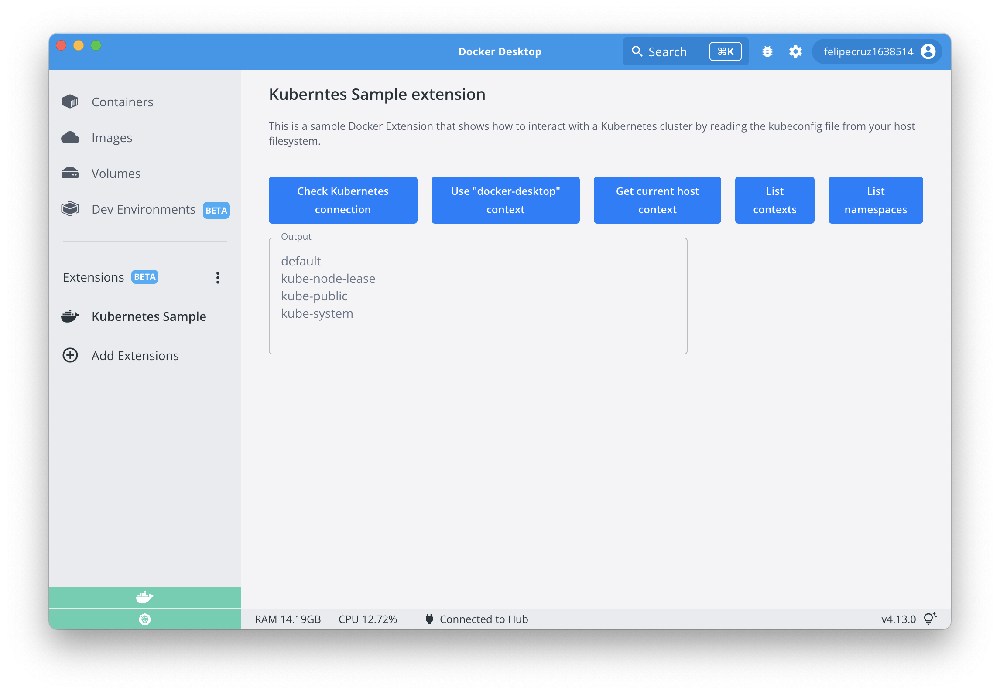

# Kubernetes Sample Extension

This is a sample Docker Extension that shows how to interact with a Kubernetes cluster by shipping the `kubectl` command line too to read the `kubeconfig` file from your host filesystem.

